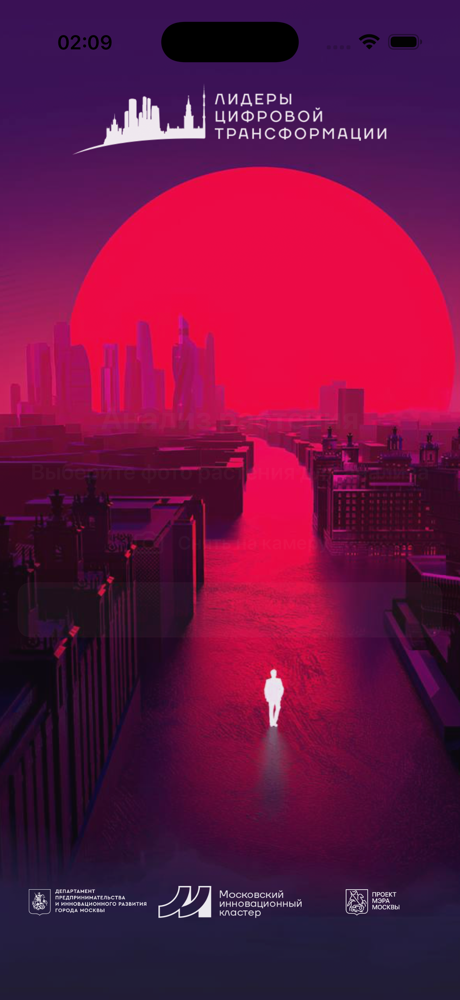
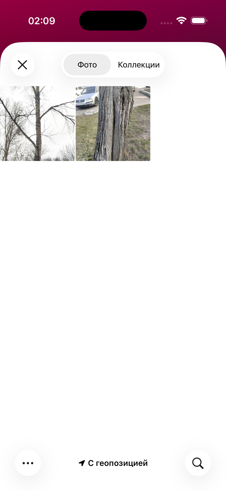
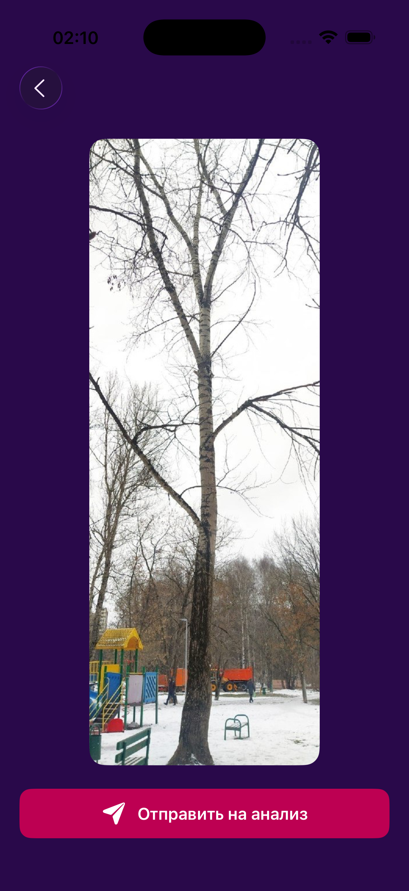
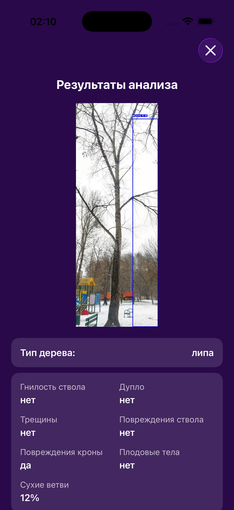
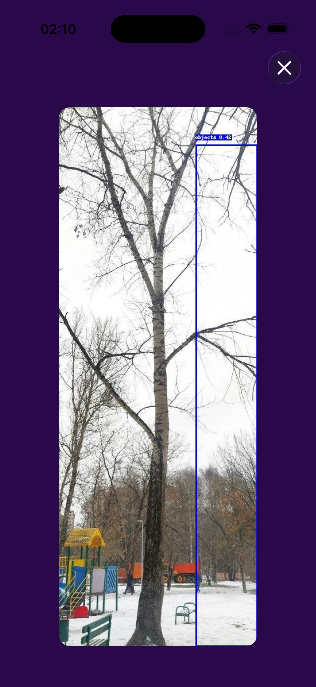

# Politech Department Of Nature Management

Приложение для анализа состояния зелёных насаждений города по фотографиям с использованием **SwiftUI** и API-сервиса компьютерного зрения.

Проект создан в рамках задания по разработке ПО для мониторинга и классификации деревьев и кустарников. Цель — помочь определять характеристики состояния растений и выявлять потенциально опасные экземпляры для своевременного принятия управленческих решений.

---

## 🚀 Возможности

* Загрузка фото дерева или кустарника (камера / галерея).
* Анализ изображения через API-сервис:

  * Определение породы дерева.
  * Выявление стволовой гнили.
  * Наличие дупел, трещин и повреждений ствола.
  * Состояние кроны, процент сухих ветвей.
  * Наличие плодовых тел и других характеристик.
* Получение текстового описания состояния дерева.
* Отображение фото с результатами анализа.
* Быстрый отклик (до 30 секунд на одно фото).

---

## 🛠️ Технологии

* **SwiftUI** — интерфейс приложения.
* **Async/await + URLSession** — работа с сетью.
* **Custom API** (репозиторий сервиса: [plant_disease_api](https://github.com/kurorodev/plant_disease_api)).
* Архитектура: **MVVM + сервисный слой**.

---

## 📷 Скриншоты

| Splash | Главный | Выбор фото | Анализ фото | Результаты | Фото на весь экран |
|--------|---------|------------|-------------|------------|--------------------|
|  |  |  |  |  |  |

---

## 🎥 Видео работы

📽 [Скачать/посмотреть демо](docs/video/demo.mp4)

---

## 📦 Установка и запуск

1. Склонировать репозиторий
2. Открыть проект в **Xcode**.
3. Проверить, что установлен Swift 5.7+ и iOS SDK (iOS 15+).
4. Убедиться, что API-сервис [plant_disease_api](https://github.com/kurorodev/plant_disease_api) запущен и доступен.\
5. Запустить проект на симуляторе или устройстве.

---

## 📂 Структура проекта

```
PolitechDepartmentOfNatureManagement
├── Assets/                      # Темы, стили, ассеты
│   ├── AppBackground.swift
│   ├── AppTheme.swift
│   ├── Assets.xcassets
│   └── Button/
│       ├── AppButtonStyles.swift
│       ├── CameraButton.swift
│       ├── GalleryPickerButton.swift
│       └── Picker/
├── Common/                      # Точка входа и корневые вью
│   ├── PolitechDepartmentOfNatureManagementApp.swift
│   └── RootView.swift
├── Extensions/                   # Расширения
│   ├── UIImage+Extension.swift
│   └── View+AppBackground.swift
├── PlantApp/                     # Основное приложение
│   ├── PhotoReviewView/
│   │   ├── PhotoReviewView.swift
│   │   └── PhotoReviewViewModel.swift
│   ├── PlantView/
│   │   ├── PlantView.swift
│   │   └── PlantViewModel.swift
│   ├── ResultsAnalyzeView/
│   │   ├── ResultsAnalyzeView.swift
│   │   ├── ResultsAnalyzeTableView.swift
│   │   └── FullScreenImageView/
│   │       └── FullScreenImageView.swift
│   └── PlantRoute/
│       └── PlantRoute.swift
├── Services/                     # Сетевой слой
│   ├── Requests/
│   │   ├── AnalyzeTreeRequestDTO.swift
│   │   ├── PlantRequest.swift
│   │   └── RequestConstants.swift
│   ├── Response/
│   │   ├── AnalyzeTreeResponseDTO.swift
│   │   ├── PlantAnalysisResponse.swift
│   │   └── LoadingState.swift
│   ├── NetworkClient.swift
│   ├── NetworkRequest.swift
│   └── PlantService/
│       └── PlantService.swift
└── SplashScreen/                 # Экран загрузки
    └── SplashView.swift
```

### Основные модули

* **Assets** — UI-темы, стили и кнопки.
* **Common** — стартовые экраны и точка входа.
* **Extensions** — полезные расширения для View и UIImage.
* **PlantApp** — основная логика: загрузка фото, просмотр, анализ и отображение результатов.
* **Services** — работа с API (запросы, ответы, сетевой клиент, сервис).
* **SplashScreen** — экран загрузки при запуске приложения.

---

## 📑 Соответствие ТЗ

* Поддержка анализа фото любых источников (смартфон, камера).
* Определение породы и характеристик дерева (>90% из списка в ТЗ).
* Время обработки ≤ 30 сек.
* Результат: фото + таблица с характеристиками.
* Интуитивно понятный интерфейс на мобильном устройстве (iOS).

---

## 👥 Команда

* **Demain Petropavlov** — разработка iOS-приложения.
* **Daniil Kudryavcev** — разработка API-сервиса для анализа растений.

---

## 📬 Контакты

* GitHub: [DemiDevv](https://github.com/DemiDevv)
* Email: *(demyanpain@gmail.com)*
* Telegram: *@dpdeceased*
